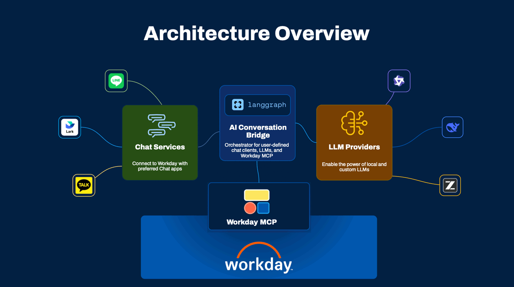

# アーキテクチャ

<p align="center"><sub>
  <a href="../../../docs/architecture.md">English</a> |
  <a href="../../zh-Hans/docs/architecture.md">简体中文</a> |
  <a href="../../zh-Hant/docs/architecture.md">繁體中文</a> |
  日本語 |
  <a href="../../ko/docs/architecture.md">한국어</a>
</sub></p>

---

> **Outdated translation:** This page has not been updated for v0.2.0. See the [English version](../../../docs/architecture.md). The data-retention claim in this translation is outdated — English docs are authoritative; see [TRANSLATION_NEEDED.md](../../TRANSLATION_NEEDED.md).

## 概要
<p align="center">
   
</p>

AI Conversation Bridgeは、AI駆動のオーケストレーションを通じて企業向けメッセージングプラットフォームをWorkdayに接続するリファレンスアーキテクチャです。アジア太平洋および日本（APJ）地域における次の四つの重要な課題に対応します。

1. **規制上の制限** —— 中国の規制により、国外ホストのLLMが利用できない
2. **言語／文脈のギャップ** —— エンタープライズLLMは顧客固有の専門用語をうまく扱えない
3. **スーパーアプリの優位** —— 中国のワーカーはWeChat（ウィーチャット）、日本はLINE、韓国はKakaoTalk（カカオトーク）を使う
4. **Androidの入手不可** —— Google Play ストアは中国でブロックされている

## このリポジトリが提供するもの／提供しないもの

### 提供するもの

- ブリッジパターンのリファレンス実装：チャットアダプター -> Flowiseオーケストレーション -> MCPツール -> Workday実行システム。
- チームが安全にフローをプロトタイプできるよう、モックMCPサーバー付きの開発・デモ環境。
- 顧客とパートナーが自環境で本番デプロイを構築するための出発点。

### 提供しないもの

- 本番対応のWorkday MCPエンドポイントでも、Workday Agent Gatewayの代替でもない。
- 単一リリースで揃う完全なマルチプラットフォームアダプター一式ではない。
- FlowiseやLLMホスティングのマネージドランタイムではない。

## システムアーキテクチャ

```text
┌──────────────────────────────────────────────────────────────────────────────┐
│                          AI CONVERSATION BRIDGE                              │
│                                                                              │
│  ┌────────────────┐  ┌────────────────┐  ┌────────────────┐  ┌───────────┐   │
│  │ Chat Platform  │  │     Chat       │  │    Flowise     │  │    MCP    │   │
│  │  (External)    │─▶│   Connector    │─▶│  (The Core)    │─▶│  Server   │   │
│  │                │◀─│                │◀─│                │◀─│ (Workday) │   │
│  └────────────────┘  └────────────────┘  └────────────────┘  └───────────┘   │
│                                                                              │
│  LINE WORKS          Webhook adapter     LLM orchestration    Tool execution │
│  DingTalk            Message routing     Intent recognition   Workday APIs   │
│  WeChat/KakaoTalk    Response delivery   Jargon translation   Mock data(dev) │
└──────────────────────────────────────────────────────────────────────────────┘
```

> **凡例：** 上図の枠内ラベルは、GitHub上の等幅フォントでの描画が崩れないよう英語のまま残しています。日本語での読みは次のとおりです。

| 図中のラベル | 日本語での読み |
| --- | --- |
| Chat Platform (External) | チャットプラットフォーム（外部） |
| Chat Connector | チャットコネクター |
| Flowise (The Core) | Flowise（コア） |
| MCP Server (Workday) | MCPサーバー（Workday） |
| Webhook adapter / Message routing / Response delivery | Webhookアダプター / メッセージルーティング / レスポンス配信 |
| LLM orchestration / Intent recognition / Jargon translation | LLMオーケストレーション / 意図認識 / 専門用語の変換 |
| Tool execution / Workday APIs / Mock data (dev) | ツール実行 / Workday API / モックデータ（開発） |

## コンポーネント詳細

### チャットコネクター（`bridge-service/`）

次を担う、軽量でステートレスなFlaskアプリケーションです。

- メッセージングプラットフォームからのWebhookを受信する
- ユーザーのメッセージと識別情報を抽出する
- メッセージをFlowiseに転送する
- AIの応答をユーザーに送り返す

コネクターには**ビジネスロジックがありません** —— 純粋なアダプターです。新しいチャットプラットフォームを追加するときは、新しいサービスファイルとルートを足すだけで、AIパイプラインは変えません。同一デプロイで複数のチャネルコネクターを同時に有効にできます。たとえば、LINE WORKSとDingTalk（ディントーク）の両方から、共有のFlowise／OpenRouterバックエンドに同時に流し込めます。

外部のメッセージングプラットフォームからWebhookを受けるため、チャットコネクターはHTTPSエンドポイント付きの**パブリック向け環境にデプロイする必要があります**。Google Cloud Runを参考例としていますが、パブリックURLを提供する任意のコンテナプラットフォームで動作します（AWS App Runner、Azure Container Apps、Alibaba Cloud Elastic Container Instance、Tencent Kubernetes Engineなど）。

**ランタイム：** Python / Gunicorn / Cloud Run（または同等のパブリック向けコンテナプラットフォーム）

### Flowise（`flowise/`）

実際の「ブリッジ」 —— 次を担うFlowiseフローです。

- チャットコネクターからメッセージを受信する
- 顧客が選んだLLMで処理する
- 意図を認識し、専門用語を変換する
- MCP経由でWorkdayツールを呼び出す
- 整形した応答を返す

Flowiseは、お客様自身のクラウド環境で管理します。本プロジェクトが提供するのはフローテンプレートであり、Flowiseランタイムではありません。Flowiseをセルフホストする場合は、チャットコネクターからその予測APIに到達できるよう、**パブリック向けインフラ**にデプロイする必要があります。

**ランタイム：** 顧客管理のFlowiseインスタンス（クラウド、またはパブリック向けインフラ上のセルフホスト）

### MCPサーバー（`mcp-demo-server/`）

本プロジェクトには、開発とテスト向けのモックWorkdayツールとサンプルデータを備えたデモMCPサーバーが含まれます。チャットコネクターと同様、デモサーバーもFlowiseからアクセスできるよう**クラウド環境にデプロイ**してください（例：Google Cloud Run、Alibaba Cloud Elastic Container Instance、Tencent Kubernetes Engine）。パブリックURL付きの任意のコンテナプラットフォームで動作します。

デモサーバーには**認証がありません**。本番利用には適しません。本番では、エンタープライズグレードのセキュリティ（OAuth 2.1、mTLS、監査ログ、ネットワークポリシー）を提供するAgent Gateway経由の**Workdayの公式MCPエンドポイント**に置き換えてください。Flowiseフロー内のMCP URLも、Agent GatewayのURLを指すよう更新してください。

**ランタイム：** Python / FastMCP / Cloud Run（デモ）、またはWorkday Agent Gateway（本番）

## リクエストフロー

```text
1. ユーザーがLINE WORKSまたはDingTalkで「有給休暇は残り何日ありますか？」と送信する
   │
2. チャットプラットフォームがWebhookをチャットコネクターにPOSTする
   - LINE WORKS: /lineworks/callback（またはレガシー /callback）
   - DingTalk: /dingtalk/callback
   - Feishu: /feishu/callback
   │
3. チャットコネクターがメッセージ + プラットフォーム単位のセッションIDを抽出し、Flowise予測APIを呼び出す
   │
4. Flowise LLMが意図を認識する：get_current_user_time_off_balance
   │
5. Flowise MCPクライアントがMCPサーバーを呼び出す → get_current_user_time_off_balance()
   │
6. MCPサーバーが返す：{ vacation: { available: 12, used: 3 } }
   │
7. Flowise LLMが応答を整形する：「有給休暇は残り12日です（全15日のうち3日使用済み）」
   │
8. チャットコネクターが応答を受け取り、元のチャットプラットフォーム経由で送り返す
```

## 主要な設計原則

### 関心の明確な分離

- **Workday**はMCP経由で、安全な「実行システム」であり続ける
- **顧客**がAIレイヤー（自前のLLM）とメッセージング／UIを制御する
- **本ブリッジ**（Flowise）が両者を接続し、機密データを保存しない

### データ主権

顧客のLLMは自環境で動作します。メッセージは自インフラ経由で処理されます。本ブリッジは、規制要件を満たすよう設計されています。

### プラットフォーム非依存

チャットコネクターのパターンは、どのメッセージングプラットフォームにも適用できます。Flowiseフローにプラットフォーム固有のWebhookや返信ロジックは不要です。コネクターが`lineworks:<userId>`や`dingtalk:<conversationId>:<senderStaffId>`のようなプラットフォーム単位のセッションIDを渡すため、同時稼働するチャットチャネルが会話メモリ上で衝突しません。

### 本番環境の堅牢化

本リファレンスアーキテクチャは、ベースラインのセキュリティ（Webhook署名検証、入力制限、レスポンス検証）を実装しています。本番環境へのデプロイにあたっては、レート制限、PIIの取り扱い、リトライロジック、アイデンティティマッピング、オブザーバビリティ、インフラ選定（公式のWorkday MCPサーバー、Flowise Cloud Enterprise）について[エンタープライズ堅牢化ガイド](enterprise-guide.md)を参照してください。
